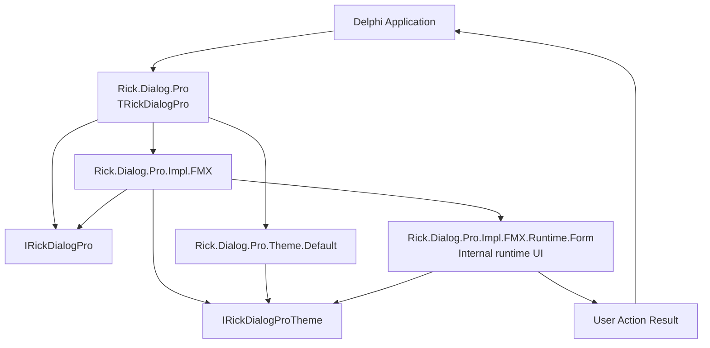
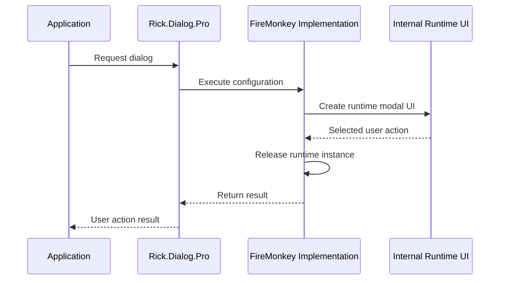

<div align="center">

# 💬 RickDialogPro

### Professional modal dialogs for Delphi FireMonkey

A modern, reusable dialog framework designed for Delphi applications, with a clean public API, runtime rendering, theme separation, and strict preservation of application business rules.

[](https://docwiki.embarcadero.com/RADStudio/en/Delphi_Language_Guide_Index)
[](https://www.embarcadero.com/products/delphi)
[](https://docwiki.embarcadero.com/RADStudio/en/FireMonkey_Application_Platform)
[](#-project-status)
[](LICENSE)

**English** · [Português (Brasil)](README.pt-BR.md)

[Overview](#-overview) · [Highlights](#-highlights) · [Architecture](#-architecture) · [Quick Start](#-quick-start) · [Tests](#-automated-tests) · [Structural Changes](#-structural-changes-in-this-reorganization) · [Roadmap](#-roadmap) · [License](#-license)

</div>

---

## 📖 Overview

**RickDialogPro** is a Delphi FireMonkey framework focused on presenting consistent, reusable, and visually controlled modal dialogs without coupling the consuming application to a concrete UI implementation.

The public API is exposed through **`Rick.Dialog.Pro`** and the **`TRickDialogPro`** facade. Internal implementation units remain separated from the supported consumer entry point.

> [!IMPORTANT]
> RickDialogPro is currently under structural modernization. The priority is to improve responsibility separation while preserving existing behavior. Internal implementation details may continue to evolve before the first stable release.

---

## ✨ Highlights

- 🎯 **Simple public entry point** through `Rick.Dialog.Pro` and `TRickDialogPro`.
- 🪟 **Runtime-created dialogs**, without requiring a dedicated `.fmx` form for the framework itself.
- 🧩 **Clear separation of responsibilities** between public API, contracts, FireMonkey implementation, runtime UI, public types, and visual themes.
- 🎨 **Theme-oriented design**, keeping visual decisions separate from dialog rendering.
- 🔌 **Interface-oriented architecture** where appropriate, reducing direct dependency on concrete implementations.
- 🧱 **No business-rule ownership**: the dialog reports the user's action; the consuming application decides what that action means.
- 🧭 **Conservative modernization**: structural improvement without intentional changes to behavior, algorithms, execution flow, or exception semantics.
- 🧪 **Automated DUnitX coverage** for configuration, themes, runtime rendering, interaction behavior, modal results, and the public facade.
- 📚 **Documentation-first release process**, with code/documentation consistency as a quality gate.

---

## 🚦 Project Status

> **Current stage:** active development / structural modernization.

The public entry point is currently defined as:

```text
Public unit   : Rick.Dialog.Pro
Public facade : TRickDialogPro
```

The project includes an automated DUnitX suite integrated into the repository. The current source tree declares **48 automated tests**, and the test project is configured for the Win32 target.

The current project package does not include a persisted DUnitX execution-result artifact. For that reason, this documentation records the suite and its configured target, but does not claim a fresh pass result for this revision. Additional target platforms remain unvalidated until they are built and executed in their own environments.

---

## 🧠 Design Principles

RickDialogPro is organized around a small set of non-negotiable engineering principles:

- **Behavior preservation before architectural elegance**.
- **Separation of Concerns** between contracts, implementation, runtime UI, visual themes, and consuming business logic.
- **High cohesion and low coupling** between units.
- **Dependency direction kept explicit** and free of unnecessary circular references.
- **Public API stability** whenever structural changes do not require otherwise.
- **No functional refactoring disguised as structural cleanup**.

These principles guide organization; they do not authorize changes to business behavior.

---

## 🏗 Architecture

The current architecture keeps the consuming application isolated from the internal FireMonkey implementation.



### Current unit responsibilities

| Unit | Responsibility |
|---|---|
| `Rick.Dialog.Pro` | Public facade and recommended consumer entry point. |
| `Rick.Dialog.Pro.Interf` | Public dialog contract. |
| `Rick.Dialog.Pro.Types` | Public configuration and result types. |
| `Rick.Dialog.Pro.Impl.FMX` | FireMonkey implementation of the public contract and control of the dialog execution lifecycle. |
| `Rick.Dialog.Pro.Impl.FMX.Runtime.Form` | Internal implementation of the runtime-created modal UI. |
| `Rick.Dialog.Pro.Icons` | Icon data and resolution used by the visual implementation. |
| `Rick.Dialog.Pro.Theme.Interf` | Visual theme contract. |
| `Rick.Dialog.Pro.Theme.Default` | Current default theme implementation. |
| `Rick.Dialog.Pro.Theme.Default.Colors` | Color constants used by the default theme. |

Units under `Rick.Dialog.Pro.Impl.*` are implementation details. Consumer code should use the public `Rick.Dialog.Pro` facade rather than depending directly on internal units.

---

## 🧩 Responsibility Boundary

RickDialogPro handles **presentation** and **user action capture** only.

It does not own application-specific concerns such as:

- database access;
- HTTP/API calls;
- persistence;
- business validation;
- retries or workflow orchestration;
- domain decisions;
- business logging;
- application configuration rules.

This boundary keeps the component reusable and prevents the dialog layer from becoming a hidden service layer.

---

## 🚀 Quick Start

The current public API is available through `Rick.Dialog.Pro` and `TRickDialogPro`.

### Information dialog

```delphi
uses
  Rick.Dialog.Pro;

begin
  TRickDialogPro.New.Information(
    'Information',
    'The operation was completed.',
    'OK'
  );
end;
```

### Confirmation-style dialog

```delphi
uses
  Rick.Dialog.Pro;

begin
  TRickDialogPro.New.Warning(
    'Attention',
    'Review the data before continuing.',
    'Continue',
    'Cancel'
  );
end;
```

The dialog presents choices and returns the selected action. The consuming application remains responsible for deciding what happens next.

A FireMonkey consumer example is included under `source/`, consumes the framework through the public `Rick.Dialog.Pro` unit, and demonstrates the default theme plus two consumer-side custom themes (`Light` and `Green`).

---

## 📚 Documentation

For complete usage examples, configuration details, result handling, and custom-theme guidance, see:

- [Usage Guide](docs/GUIDE.md)
- [Guia de Uso em Português](docs/GUIDE.pt-BR.md)

---

## 🧪 Automated Tests

RickDialogPro includes a dedicated DUnitX console project under `tests/`. The suite is part of `RickDialog.groupproj`, uses the same framework sources consumed by the example project, and writes an NUnit-compatible XML result when executed through the standard DUnitX runner.

The current suite contains **48 automated tests**. They exercise the parts of the framework that can be checked deterministically without relying on pixel-perfect rendering: configuration builders and defaults, icon data, the default theme, runtime form creation, background behavior, themed surfaces and text, semantic colors, primary and secondary buttons, hover states, tooltip behavior, modal results, and end-to-end calls through `TRickDialogPro`.

The modal tests drive the actual runtime form and button handlers. The suite also checks the three dialog results currently exposed by the implementation: `None`, `Primary`, and `Secondary`.

The test project is currently enabled for **Win32**. The current source tree contains **48 `[Test]` declarations**. Because the project package used for this review does not contain a persisted DUnitX result XML, the execution outcome must be recorded again during the build/test quality gate before the stable release.

To run the suite from Delphi, open `RickDialog.groupproj` or `tests/RickDialogPro.Tests.dproj`, select the Win32 target, build, and run `RickDialogPro.Tests`. The test project already carries the source search paths required by the framework and uses `--exitbehavior:Pause` for console execution from the IDE.

The automated suite validates behavior and component state. Visual appearance across fonts, DPI settings, window managers, and operating systems still requires platform-specific verification.

---

## 🎭 Dialog Semantics

The current implementation uses four visual semantics:

| Semantic | Intended use |
|---|---|
| `Error` | Failures or situations requiring immediate attention. |
| `Warning` | Confirmation, review, or caution before continuing. |
| `Information` | Neutral information or acknowledgement. |
| `Success` | Successful completion of an operation. |

Visual details such as status colors, icons, button states, and surfaces belong to the active theme rather than to application business logic.

---

## 🎨 Theming

The theme contract separates visual values from the dialog implementation.

A theme can provide values for elements such as:

- window background;
- primary and elevated surfaces;
- borders;
- primary and secondary text;
- semantic status colors;
- icon background and stroke;
- primary button states;
- secondary button states;
- hover/interactivity states.

Theme concerns remain separate from the business rules of the consuming application.

In the current configuration, `UseBackground` is `False` by default. When enabled through `TRickDialogProConfig` and executed with `Execute`, the RuntimeForm uses `IRickDialogProTheme.Background` as the host form `Fill.Color`. The complete guide documents this usage and the fact that `Transparency = True` remains unchanged.

---

## 🔄 Lifecycle

For each execution, the FireMonkey implementation creates the runtime modal UI, performs the modal interaction, and releases that runtime instance when the operation completes.



The internal runtime UI is an implementation detail and is not the supported consumer entry point.

---

## 📦 Installation

Until a versioned distribution mechanism is published, integration is source-based.

```bash
git clone https://github.com/ricksolucoes/RickDialogPro.git
```

When directly referencing the sources using the repository's current layout, the included FireMonkey example uses these Delphi **Search Path** directories:

```text
src
src\Impl
src\Theme
source\theme
```

These paths describe the current source organization; they are not a declaration of how every future distribution mechanism must be configured.

> [!NOTE]
> No package manager integration, IDE installer, or GetIt distribution is currently declared.

---

## 🧰 Compatibility

| Item | Status |
|---|---|
| **Delphi 12 Athens** | Primary development target. |
| **FireMonkey** | Target UI framework. |
| **Win32** | DUnitX project configured for Win32 with 48 tests; a current execution result must still be recorded in the build/test quality gate. |
| **Other platforms** | Not yet validated by the current automated test project. |

RickDialogPro only declares compatibility after technical validation. The current test project is configured for Win32, but the project package reviewed here does not contain a persisted execution result; Win32 execution must therefore be confirmed again in the build/test quality gate. Other targets remain pending until they are built and exercised directly.

---

## 📁 Repository Structure

The current repository structure relevant to framework development and the included example is:

```text
RickDialogPro/
├── src/
│   ├── Rick.Dialog.Pro.pas
│   ├── Rick.Dialog.Pro.Interf.pas
│   ├── Rick.Dialog.Pro.Types.pas
│   ├── Rick.Dialog.Pro.Icons.pas
│   ├── Impl/
│   │   ├── Rick.Dialog.Pro.Impl.FMX.pas
│   │   └── Rick.Dialog.Pro.Impl.FMX.Runtime.Form.pas
│   └── Theme/
│       ├── Rick.Dialog.Pro.Theme.Interf.pas
│       ├── Rick.Dialog.Pro.Theme.Default.pas
│       └── Rick.Dialog.Pro.Theme.Default.Colors.pas
├── source/
│   ├── RickDialogPro.Source.dpr
│   ├── RickDialogPro.Source.dproj
│   ├── theme/
│   │   ├── RickDialogPro.Source.Theme.Light.pas
│   │   ├── RickDialogPro.Source.Theme.Light.Colors.pas
│   │   ├── RickDialogPro.Source.Theme.Green.pas
│   │   └── RickDialogPro.Source.Theme.Green.Colors.pas
│   └── view/
│       ├── RickDialogPro.Source.Page.Main.pas
│       └── RickDialogPro.Source.Page.Main.fmx
├── tests/
│   ├── RickDialogPro.Tests.dpr
│   ├── RickDialogPro.Tests.dproj
│   └── src/
│       ├── Rick.Dialog.Pro.Tests.Environment.pas
│       ├── Support/
│       │   ├── Rick.Dialog.Pro.Tests.FMX.Helpers.pas
│       │   └── Rick.Dialog.Pro.Tests.ThemeSpy.pas
│       └── Units/
│           ├── Rick.Dialog.Pro.Tests.Types.pas
│           ├── Rick.Dialog.Pro.Tests.Icons.pas
│           ├── Rick.Dialog.Pro.Tests.Theme.Default.pas
│           └── Rick.Dialog.Pro.Tests.Runtime.Form.pas
├── RickDialogPro.dpr
├── RickDialogPro.dproj
├── RickDialog.groupproj
├── README.md
├── README.pt-BR.md
├── LICENSE
└── LICENSE-pt-BR
```

---

## 🔧 Structural Changes in This Reorganization

- Added the internal unit `Rick.Dialog.Pro.Impl.FMX.Runtime.Form`.
- Moved the runtime modal UI implementation out of `Rick.Dialog.Pro.Impl.FMX` into the new internal unit.
- Kept `Rick.Dialog.Pro.Impl.FMX` responsible for the FireMonkey implementation of `IRickDialogPro` and for the dialog execution lifecycle.
- Kept the public `Rick.Dialog.Pro` facade unchanged as the supported consumer entry point.
- This reorganization does not introduce new dialog functionality.

---

## 🤝 Contributing

RickDialogPro is currently in an architectural consolidation phase. A formal contribution guide has not yet been published.

For bug reports, questions, or proposals, use the repository's [Issues](https://github.com/ricksolucoes/RickDialogPro/issues) section. Contributions should preserve existing behavior unless a functional change is explicitly discussed and approved as a separate scope.

---

## 🔐 License

Copyright © 2026 **RickSoluções**. All rights reserved.

RickDialogPro is **proprietary software** made available under a **Revocable Limited-Use License**. The license grants limited, non-exclusive, non-transferable, and revocable authorization to use, study, test, and modify the Software while that authorization remains valid.

The license does **not** automatically authorize redistribution, sublicensing, publication, hosting, commercialization, SaaS use, or incorporation into commercial products or services. Commercial, enterprise, OEM, SaaS, redistribution, hosting, and other rights may be granted separately in writing by RickSoluções.

- 📄 **Official license (English):** [`LICENSE`](LICENSE)
- 🇧🇷 **Portuguese translation:** [`LICENSE-pt-BR`](LICENSE-pt-BR)

> [!IMPORTANT]
> The source code being publicly accessible does not make RickDialogPro open source and does not grant rights beyond those expressly stated in the applicable license.

---

## 👤 Maintainer

**RickSoluções**  
Owner and maintainer of **RickDialogPro**.

---

<div align="center">

### 💬 RickDialogPro

**Professional dialogs. Clear responsibilities. Delphi-first design.**

[⬆ Back to top](#-rickdialogpro)

</div>
