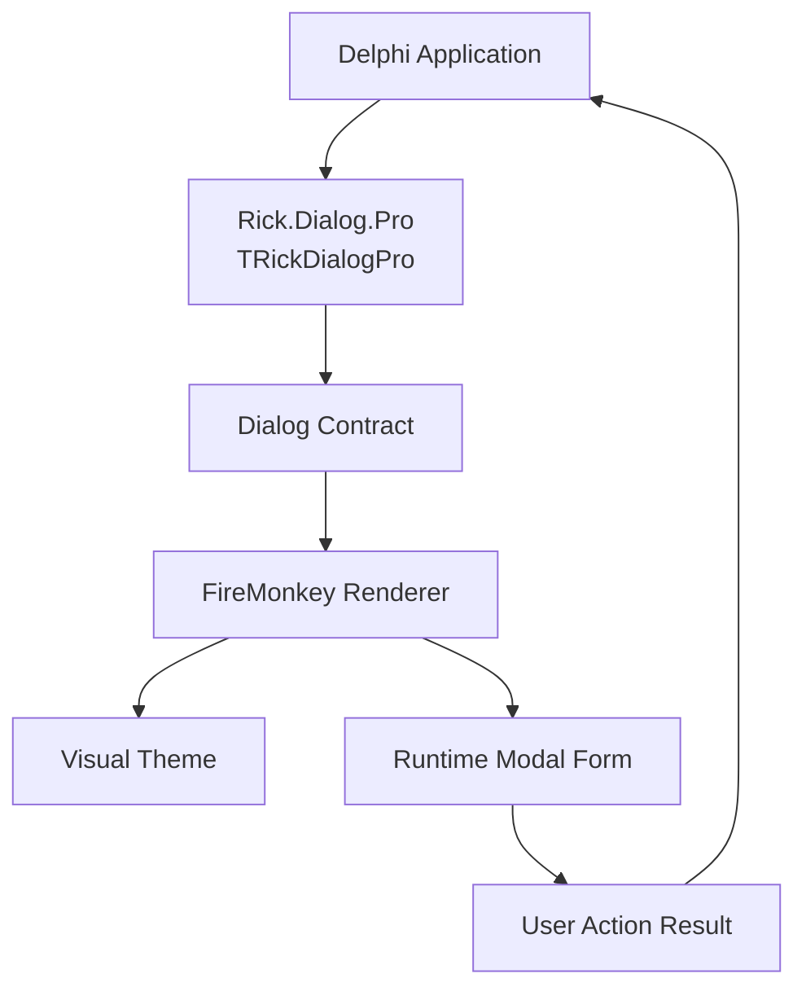
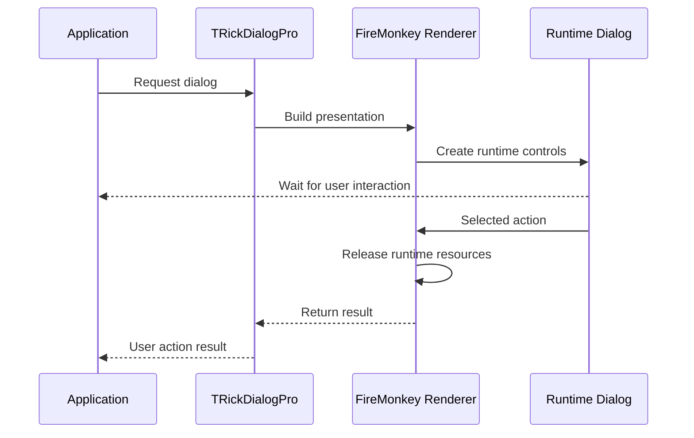

<div align="center">

# 💬 RickDialogPro

### Professional modal dialogs for Delphi FireMonkey

A modern, reusable dialog framework designed for Delphi applications, with a clean public API, runtime rendering, theme separation, and strict preservation of application business rules.

[](https://docwiki.embarcadero.com/RADStudio/en/Delphi_Language_Guide_Index)
[](https://www.embarcadero.com/products/delphi)
[](https://docwiki.embarcadero.com/RADStudio/en/FireMonkey_Application_Platform)
[](#-overview)

[](#-project-status)
[](https://github.com/ricksolucoes/RickDialogPro)
[](https://github.com/ricksolucoes/RickDialogPro/commits)
[](https://github.com/ricksolucoes/RickDialogPro)
[](https://github.com/ricksolucoes/RickDialogPro/issues)
[](https://github.com/ricksolucoes/RickDialogPro/stargazers)
[](https://github.com/ricksolucoes/RickDialogPro/network/members)
[](#-license)

**English** · [Português (Brasil)](README.pt-BR.md)

[Overview](#-overview) · [Highlights](#-highlights) · [Architecture](#-architecture) · [Quick Start](#-quick-start) · [Roadmap](#-roadmap) · [License](#-license)

</div>

---

## 📖 Overview

**RickDialogPro** is a Delphi FireMonkey framework focused on presenting consistent, reusable, and visually controlled modal dialogs without coupling the consuming application to a concrete UI implementation.

The project is being redesigned around the public unit **`Rick.Dialog.Pro`** and the public facade **`TRickDialogPro`**. The existing implementation is being used only as the functional reference for this evolution.

> [!IMPORTANT]
> RickDialogPro is currently under structural modernization. The priority is to reorganize responsibilities while preserving existing behavior. Internal units, contracts, and implementation details may change before the first stable release.

---

## ✨ Highlights

- 🎯 **Simple public entry point** through `Rick.Dialog.Pro` and `TRickDialogPro`.
- 🪟 **Runtime-created dialogs**, without requiring a dedicated `.fmx` form for the framework itself.
- 🧩 **Clear separation of responsibilities** between public API, contracts, renderer, types, and visual themes.
- 🎨 **Theme-oriented design**, keeping visual decisions separate from dialog rendering.
- 🔌 **Interface-oriented architecture** where appropriate, reducing direct dependency on concrete implementations.
- 🧱 **No business-rule ownership**: the dialog reports the user's action; the consuming application decides what that action means.
- 🧭 **Conservative modernization**: structural improvement without intentional changes to behavior, algorithms, execution flow, or exception semantics.
- 📚 **Documentation-first release process**, with code/documentation consistency as a quality gate.

---

## 🚦 Project Status

> **Current stage:** active development / structural modernization.

The target public naming is already defined:

```text
Public unit   : Rick.Dialog.Pro
Public facade : TRickDialogPro
```

The first stable release will only be considered ready after structural review, documentation review, static validation, and—when a Delphi build environment is available—successful compilation and execution of the existing automated tests.

No compatibility claim is made for an unvalidated Delphi version or target platform.

---

## 🧠 Design Principles

RickDialogPro is being organized around a small set of non-negotiable engineering principles:

- **Behavior preservation before architectural elegance**.
- **Separation of Concerns** between contracts, implementation, visual themes, and consuming business logic.
- **High cohesion and low coupling** between units.
- **Dependency direction kept explicit** and free of unnecessary circular references.
- **Public API stability** whenever structural changes do not require otherwise.
- **No functional refactoring disguised as structural cleanup**.

These principles guide organization; they do not authorize changes to business behavior.

---

## 🏗 Architecture

The intended architecture keeps the consuming application isolated from the concrete FireMonkey renderer.



### Responsibilities

| Layer | Responsibility |
|---|---|
| **Public facade** | Exposes the supported API to the consuming application. |
| **Contracts** | Defines dialog capabilities without binding consumers to a concrete renderer. |
| **Public types** | Represents dialog semantics, configuration, and user action results. |
| **FireMonkey renderer** | Creates, displays, and disposes the runtime visual tree. |
| **Theme** | Provides visual decisions such as colors and interaction states. |
| **Consuming application** | Owns all business rules triggered by the returned user action. |

---

## 🧩 Responsibility Boundary

RickDialogPro is intended to handle **presentation** and **user action capture** only.

It must not own application-specific concerns such as:

- database access;
- HTTP/API calls;
- persistence;
- business validation;
- retries or workflow orchestration;
- domain decisions;
- business logging;
- application configuration rules.

This boundary keeps the component reusable and prevents the dialog layer from becoming a hidden service layer.

---

## 🚀 Quick Start

The public API is being standardized around `Rick.Dialog.Pro` and `TRickDialogPro`.

> [!NOTE]
> The examples below illustrate the intended usage derived from the current functional reference. Final signatures will be documented from the validated implementation before the first stable release.

### Information dialog

```delphi
uses
  Rick.Dialog.Pro;

begin
  TRickDialogPro.New.Information(
    'Information',
    'The operation was completed.',
    'OK'
  );
end;
```

### Confirmation-style dialog

```delphi
uses
  Rick.Dialog.Pro;

begin
  TRickDialogPro.New.Warning(
    'Attention',
    'Review the data before continuing.',
    'Continue',
    'Cancel'
  );
end;
```

The dialog presents choices and returns the selected action. The consuming application remains responsible for deciding what happens next.

---

## 🎭 Dialog Semantics

The functional reference currently uses four visual semantics:

| Semantic | Intended use |
|---|---|
| `Error` | Failures or situations requiring immediate attention. |
| `Warning` | Confirmation, review, or caution before continuing. |
| `Information` | Neutral information or acknowledgement. |
| `Success` | Successful completion of an operation. |

Visual details such as status colors, icons, button states, and surfaces belong to the active theme rather than to application business logic.

---

## 🎨 Theming

The design goal is to keep the renderer independent from a specific visual identity.

A theme may provide values for elements such as:

- window background;
- primary and elevated surfaces;
- borders;
- primary and secondary text;
- semantic status colors;
- icon background and stroke;
- primary button states;
- secondary button states;
- hover/interactivity states.

Theme replacement should not require changing the behavior of the dialog renderer.

---

## 🔄 Lifecycle

The conceptual lifecycle of a dialog call is:



The intended implementation model creates the modal UI for the call and releases the runtime visual resources when the interaction completes.

---

## 📦 Installation

Until a versioned distribution mechanism is published, integration is source-based.

```bash
git clone https://github.com/ricksolucoes/RickDialogPro.git
```

The final source directories that must be added to the Delphi **Search Path** will be documented after the repository structure is consolidated.

> [!NOTE]
> No package manager integration, IDE installer, or GetIt distribution is currently declared.

---

## 🧰 Compatibility

| Item | Status |
|---|---|
| **Delphi 12 Athens** | Primary modernization target; final validation pending. |
| **Modern Delphi versions** | Compatibility matrix will be published only after validation. |
| **FireMonkey** | Target UI framework. |
| **Platforms** | Supported targets will be listed only after build/test validation. |

RickDialogPro will not advertise compatibility that has not been technically confirmed.

---

## 📁 Repository Structure

The final physical layout is still being consolidated. The intended responsibility-based organization is:

```text
RickDialogPro/
├── src/                 # Framework source code
├── tests/               # Existing and future automated tests, when applicable
├── docs/                # Additional technical documentation
├── README.md            # Official documentation — English
└── README.pt-BR.md      # Portuguese translation
```

Internal unit names will be documented after the structural reorganization is approved. The public names already defined for the new generation are:

```text
Rick.Dialog.Pro
TRickDialogPro
```

---

## 🗺 Roadmap

- [ ] Establish `Rick.Dialog.Pro` as the public entry unit.
- [ ] Establish `TRickDialogPro` as the public facade.
- [ ] Separate contracts, public types, implementation, and themes into cohesive units.
- [ ] Review unit dependencies and remove unnecessary structural coupling.
- [ ] Preserve behavior while reorganizing the existing functional reference.
- [ ] Update XMLDoc and developer documentation.
- [ ] Perform independent structural and semantic code review.
- [ ] Compile supported configurations when a Delphi build environment is available.
- [ ] Run existing automated tests when available and applicable.
- [ ] Publish the validated compatibility matrix.
- [ ] Prepare the first stable release.

---

## 🤝 Contributing

RickDialogPro is currently in an architectural consolidation phase. A formal contribution guide has not yet been published.

For bug reports, questions, or proposals, use the repository's [Issues](https://github.com/ricksolucoes/RickDialogPro/issues) section. Contributions should preserve existing behavior unless a functional change is explicitly discussed and approved as a separate scope.

---

## 🔐 License

Copyright © 2026 **Ricardo R. Pereira**. All rights reserved.

This repository does **not** currently grant an open-source license to copy, modify, redistribute, sublicense, or use the source code in other projects. Any authorization must be expressly granted by the copyright holder.

If the licensing model changes, the repository will include an explicit license file and this section will be updated accordingly.

---

## 👤 Author

**Ricardo R. Pereira**  
Project and development of **RickDialogPro**.

---

<div align="center">

### 💬 RickDialogPro

**Professional dialogs. Clear responsibilities. Delphi-first design.**

[⬆ Back to top](#-rickdialogpro)

</div>
