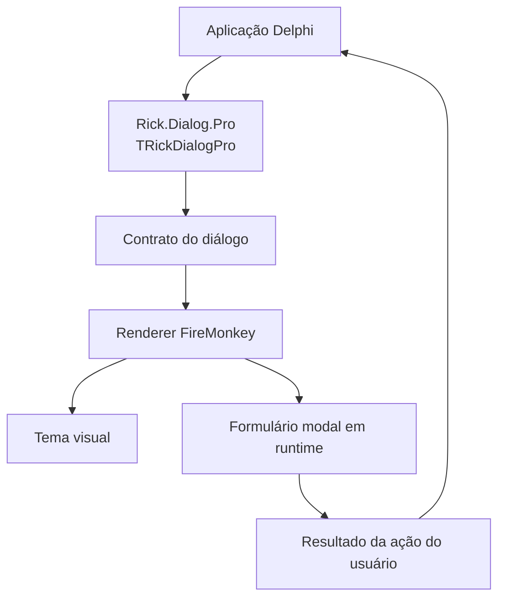
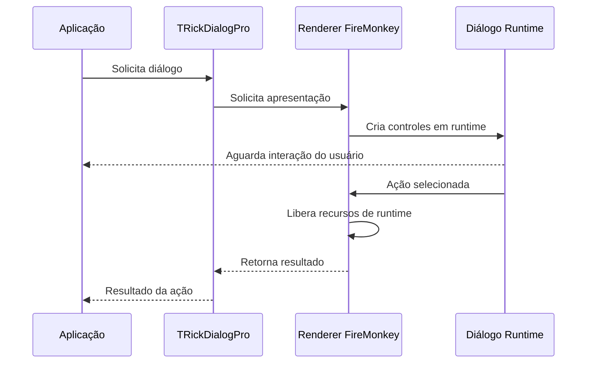

<div align="center">

# 💬 RickDialogPro

### Diálogos modais profissionais para Delphi FireMonkey

Um framework moderno e reutilizável para diálogos em aplicações Delphi, com API pública limpa, renderização em runtime, separação de temas e preservação rigorosa das regras de negócio da aplicação.

[](https://docwiki.embarcadero.com/RADStudio/en/Delphi_Language_Guide_Index)
[](https://www.embarcadero.com/products/delphi)
[](https://docwiki.embarcadero.com/RADStudio/en/FireMonkey_Application_Platform)
[](#-visão-geral)

[](#-status-do-projeto)
[](https://github.com/ricksolucoes/RickDialogPro)
[](https://github.com/ricksolucoes/RickDialogPro/commits)
[](https://github.com/ricksolucoes/RickDialogPro)
[](https://github.com/ricksolucoes/RickDialogPro/issues)
[](https://github.com/ricksolucoes/RickDialogPro/stargazers)
[](https://github.com/ricksolucoes/RickDialogPro/network/members)
[](#-licença)

[English](README.md) · **Português (Brasil)**

[Visão geral](#-visão-geral) · [Destaques](#-destaques) · [Arquitetura](#-arquitetura) · [Início rápido](#-início-rápido) · [Roadmap](#-roadmap) · [Licença](#-licença)

</div>

---

## 📖 Visão geral

**RickDialogPro** é um framework Delphi FireMonkey voltado à apresentação de diálogos modais consistentes, reutilizáveis e visualmente controlados, sem acoplar a aplicação consumidora a uma implementação concreta de interface.

O projeto está sendo redesenhado em torno da unit pública **`Rick.Dialog.Pro`** e da fachada pública **`TRickDialogPro`**. A implementação existente está sendo utilizada somente como referência funcional para essa evolução.

> [!IMPORTANT]
> O RickDialogPro está atualmente em processo de modernização estrutural. A prioridade é reorganizar responsabilidades preservando o comportamento existente. Units internas, contratos e detalhes de implementação ainda poderão mudar antes da primeira versão estável.

---

## ✨ Destaques

- 🎯 **Ponto de entrada público simples** por meio de `Rick.Dialog.Pro` e `TRickDialogPro`.
- 🪟 **Diálogos criados em runtime**, sem exigir um formulário `.fmx` dedicado ao próprio framework.
- 🧩 **Separação clara de responsabilidades** entre API pública, contratos, renderer, tipos e temas visuais.
- 🎨 **Design orientado a temas**, mantendo decisões visuais separadas da renderização do diálogo.
- 🔌 **Arquitetura orientada a interfaces** quando apropriado, reduzindo dependências diretas de implementações concretas.
- 🧱 **Sem responsabilidade sobre regras de negócio**: o diálogo informa a ação do usuário; a aplicação consumidora decide o significado dessa ação.
- 🧭 **Modernização conservadora**: melhoria estrutural sem alteração intencional de comportamento, algoritmos, fluxo de execução ou semântica de exceções.
- 📚 **Processo de entrega orientado por documentação**, com consistência código-documentação como quality gate.

---

## 🚦 Status do projeto

> **Estágio atual:** desenvolvimento ativo / modernização estrutural.

A nomenclatura pública alvo já está definida:

```text
Unit pública   : Rick.Dialog.Pro
Fachada pública: TRickDialogPro
```

A primeira versão estável somente será considerada pronta após revisão estrutural, auditoria da documentação, validação estática e — quando houver ambiente Delphi disponível — compilação bem-sucedida e execução dos testes automatizados existentes.

Nenhuma compatibilidade será declarada para uma versão do Delphi ou plataforma que ainda não tenha sido validada.

---

## 🧠 Princípios de projeto

O RickDialogPro está sendo organizado em torno de alguns princípios de engenharia não negociáveis:

- **Preservação do comportamento antes da elegância arquitetural**.
- **Separation of Concerns** entre contratos, implementação, temas visuais e regras de negócio da aplicação consumidora.
- **Alta coesão e baixo acoplamento** entre units.
- **Direção de dependências explícita**, sem ciclos desnecessários.
- **Estabilidade da API pública** sempre que mudanças estruturais não exigirem o contrário.
- **Nenhuma refatoração funcional disfarçada de reorganização estrutural**.

Esses princípios orientam a organização; eles não autorizam mudanças no comportamento funcional.

---

## 🏗 Arquitetura

A arquitetura planejada mantém a aplicação consumidora isolada do renderer concreto em FireMonkey.



### Responsabilidades

| Camada | Responsabilidade |
|---|---|
| **Fachada pública** | Expõe a API suportada para a aplicação consumidora. |
| **Contratos** | Define as capacidades do diálogo sem vincular o consumidor a um renderer concreto. |
| **Tipos públicos** | Representa semântica, configuração e resultados de interação. |
| **Renderer FireMonkey** | Cria, apresenta e libera a árvore visual construída em runtime. |
| **Tema** | Fornece decisões visuais como cores e estados de interação. |
| **Aplicação consumidora** | Mantém todas as regras de negócio acionadas pelo resultado informado pelo diálogo. |

---

## 🧩 Limite de responsabilidade

O RickDialogPro deve tratar somente **apresentação** e **captura da ação do usuário**.

Não fazem parte da responsabilidade do framework:

- acesso a banco de dados;
- chamadas HTTP ou APIs;
- persistência;
- validações de negócio;
- retentativas ou orquestração de workflow;
- decisões de domínio;
- logs de negócio;
- regras de configuração da aplicação.

Essa fronteira mantém o componente reutilizável e evita que a camada de diálogo se transforme em uma camada de serviços oculta.

---

## 🚀 Início rápido

A API pública está sendo padronizada em torno de `Rick.Dialog.Pro` e `TRickDialogPro`.

> [!NOTE]
> Os exemplos abaixo representam o uso pretendido com base na referência funcional atual. As assinaturas finais serão documentadas a partir da implementação validada antes da primeira versão estável.

### Diálogo de informação

```delphi
uses
  Rick.Dialog.Pro;

begin
  TRickDialogPro.New.Information(
    'Informação',
    'A operação foi concluída.',
    'OK'
  );
end;
```

### Diálogo com confirmação

```delphi
uses
  Rick.Dialog.Pro;

begin
  TRickDialogPro.New.Warning(
    'Atenção',
    'Revise os dados antes de continuar.',
    'Continuar',
    'Cancelar'
  );
end;
```

O diálogo apresenta as opções e devolve a ação escolhida. A aplicação consumidora continua responsável por decidir o que deve acontecer em seguida.

---

## 🎭 Semânticas de diálogo

A referência funcional trabalha atualmente com quatro semânticas visuais:

| Semântica | Uso pretendido |
|---|---|
| `Error` | Falhas ou situações que exigem atenção imediata. |
| `Warning` | Confirmação, revisão ou cautela antes de prosseguir. |
| `Information` | Informação neutra ou confirmação de ciência. |
| `Success` | Conclusão bem-sucedida de uma operação. |

Detalhes visuais como cores de status, ícones, estados dos botões e superfícies pertencem ao tema ativo, e não às regras de negócio da aplicação.

---

## 🎨 Temas

O objetivo é manter o renderer independente de uma identidade visual específica.

Um tema pode fornecer valores para elementos como:

- fundo da janela;
- superfícies principais e elevadas;
- bordas;
- texto primário e secundário;
- cores semânticas de status;
- fundo e traço de ícones;
- estados do botão principal;
- estados do botão secundário;
- estados de hover/interação.

A substituição do tema não deve exigir alteração no comportamento do renderer do diálogo.

---

## 🔄 Ciclo de vida

O ciclo conceitual de uma chamada de diálogo é:



O modelo pretendido cria a interface modal para cada chamada e libera os recursos visuais de runtime ao final da interação.

---

## 📦 Instalação

Enquanto não existir um mecanismo de distribuição versionado, a integração será baseada no código-fonte.

```bash
git clone https://github.com/ricksolucoes/RickDialogPro.git
```

Os diretórios definitivos que deverão ser adicionados ao **Search Path** do Delphi serão documentados após a consolidação da estrutura do repositório.

> [!NOTE]
> Neste momento, nenhum package manager, instalador para IDE ou distribuição via GetIt é declarado.

---

## 🧰 Compatibilidade

| Item | Status |
|---|---|
| **Delphi 12 Athens** | Alvo principal da modernização; validação final pendente. |
| **Versões modernas do Delphi** | A matriz de compatibilidade será publicada somente após validação. |
| **FireMonkey** | Framework visual alvo. |
| **Plataformas** | Os targets suportados serão informados somente após validação de build/testes. |

O RickDialogPro não declarará compatibilidade que ainda não tenha sido tecnicamente comprovada.

---

## 📁 Estrutura do repositório

A estrutura física definitiva ainda está sendo consolidada. A organização pretendida por responsabilidade é:

```text
RickDialogPro/
├── src/                 # Código-fonte do framework
├── tests/               # Testes automatizados existentes e futuros, quando aplicável
├── docs/                # Documentação técnica complementar
├── README.md            # Documentação oficial — inglês
└── README.pt-BR.md      # Tradução para português do Brasil
```

Os nomes das units internas serão documentados após a aprovação da reorganização estrutural. Os nomes públicos já definidos para a nova geração são:

```text
Rick.Dialog.Pro
TRickDialogPro
```

---

## 🗺 Roadmap

- [ ] Consolidar `Rick.Dialog.Pro` como unit pública de entrada.
- [ ] Consolidar `TRickDialogPro` como fachada pública.
- [ ] Separar contratos, tipos públicos, implementação e temas em units coesas.
- [ ] Revisar dependências entre units e remover acoplamentos estruturais desnecessários.
- [ ] Preservar comportamento durante a reorganização da referência funcional existente.
- [ ] Atualizar XMLDoc e documentação para desenvolvedores.
- [ ] Executar auditoria estrutural e semântica independente do código.
- [ ] Compilar as configurações suportadas quando houver ambiente Delphi disponível.
- [ ] Executar os testes automatizados existentes quando disponíveis e aplicáveis.
- [ ] Publicar a matriz de compatibilidade validada.
- [ ] Preparar a primeira versão estável.

---

## 🤝 Contribuição

O RickDialogPro encontra-se atualmente em fase de consolidação arquitetural. Um guia formal de contribuição ainda não foi publicado.

Para relatar problemas, dúvidas ou propostas, utilize a seção [Issues](https://github.com/ricksolucoes/RickDialogPro/issues) do repositório. Contribuições devem preservar o comportamento existente, salvo quando uma mudança funcional tiver sido explicitamente discutida e aprovada como escopo separado.

---

## 🔐 Licença

Copyright © 2026 **Ricardo R. Pereira**. Todos os direitos reservados.

Este repositório **não** concede atualmente uma licença open source para copiar, modificar, redistribuir, sublicenciar ou utilizar o código-fonte em outros projetos. Qualquer autorização deve ser concedida expressamente pelo titular dos direitos autorais.

Caso o modelo de licenciamento seja alterado, o repositório passará a incluir um arquivo de licença explícito e esta seção será atualizada.

---

## 👤 Autor

**Ricardo R. Pereira**  
Projeto e desenvolvimento do **RickDialogPro**.

---

<div align="center">

### 💬 RickDialogPro

**Diálogos profissionais. Responsabilidades claras. Engenharia orientada a Delphi.**

[⬆ Voltar ao topo](#-rickdialogpro)

</div>
