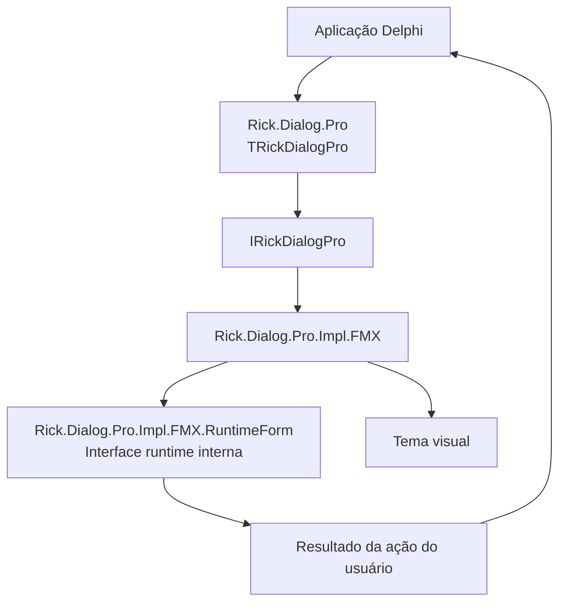
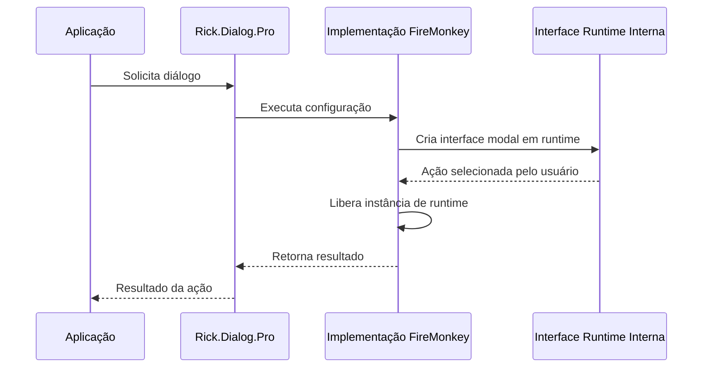

<div align="center">

# 💬 RickDialogPro

### Diálogos modais profissionais para Delphi FireMonkey

Um framework moderno e reutilizável para diálogos em aplicações Delphi, com API pública limpa, renderização em runtime, separação de temas e preservação rigorosa das regras de negócio da aplicação.

[](https://docwiki.embarcadero.com/RADStudio/en/Delphi_Language_Guide_Index)
[](https://www.embarcadero.com/products/delphi)
[](https://docwiki.embarcadero.com/RADStudio/en/FireMonkey_Application_Platform)
[](#-status-do-projeto)
[](LICENSE-pt-BR)

[English](README.md) · **Português (Brasil)**

[Visão geral](#-visão-geral) · [Destaques](#-destaques) · [Arquitetura](#-arquitetura) · [Início rápido](#-início-rápido) · [Testes](#-testes-automatizados) · [Alterações estruturais](#-alterações-estruturais-desta-reorganização) · [Roadmap](#-roadmap) · [Licença](#-licença)

</div>

---

## 📖 Visão geral

**RickDialogPro** é um framework Delphi FireMonkey voltado à apresentação de diálogos modais consistentes, reutilizáveis e visualmente controlados, sem acoplar a aplicação consumidora a uma implementação concreta de interface.

A API pública é disponibilizada por meio de **`Rick.Dialog.Pro`** e da fachada **`TRickDialogPro`**. As units internas de implementação permanecem separadas do ponto de entrada suportado para consumo.

> [!IMPORTANT]
> O RickDialogPro está atualmente em processo de modernização estrutural. A prioridade é melhorar a separação de responsabilidades preservando o comportamento existente. Detalhes internos de implementação ainda poderão evoluir antes da primeira versão estável.

---

## ✨ Destaques

- 🎯 **Ponto de entrada público simples** por meio de `Rick.Dialog.Pro` e `TRickDialogPro`.
- 🪟 **Diálogos criados em runtime**, sem exigir um formulário `.fmx` dedicado ao próprio framework.
- 🧩 **Separação clara de responsabilidades** entre API pública, contratos, implementação FireMonkey, interface runtime, tipos públicos e temas visuais.
- 🎨 **Design orientado a temas**, mantendo decisões visuais separadas da renderização do diálogo.
- 🔌 **Arquitetura orientada a interfaces** quando apropriado, reduzindo dependências diretas de implementações concretas.
- 🧱 **Sem responsabilidade sobre regras de negócio**: o diálogo informa a ação do usuário; a aplicação consumidora decide o significado dessa ação.
- 🧭 **Modernização conservadora**: melhoria estrutural sem alteração intencional de comportamento, algoritmos, fluxo de execução ou semântica de exceções.
- 🧪 **Cobertura automatizada com DUnitX** para configuração, temas, renderização em runtime, interações, resultados modais e fachada pública.
- 📚 **Processo de entrega orientado por documentação**, com consistência código-documentação como quality gate.

---

## 🚦 Status do projeto

> **Estágio atual:** desenvolvimento ativo / modernização estrutural.

O ponto de entrada público atualmente definido é:

```text
Unit pública   : Rick.Dialog.Pro
Fachada pública: TRickDialogPro
```

O projeto já conta com uma suíte automatizada em DUnitX integrada ao repositório. Na execução Win32 atualmente validada, os **48 testes passaram**, sem testes ignorados, falhas, erros ou leaks reportados.

Esse resultado confirma os comportamentos exercitados pela suíte atual em Win32. As demais plataformas continuam sendo consideradas não validadas até que sejam compiladas e executadas em seus próprios ambientes; por isso, o RickDialogPro não declara compatibilidade além das configurações que foram efetivamente verificadas.

---

## 🧠 Princípios de projeto

O RickDialogPro é organizado em torno de alguns princípios de engenharia não negociáveis:

- **Preservação do comportamento antes da elegância arquitetural**.
- **Separation of Concerns** entre contratos, implementação, interface runtime, temas visuais e regras de negócio da aplicação consumidora.
- **Alta coesão e baixo acoplamento** entre units.
- **Direção de dependências explícita**, sem ciclos desnecessários.
- **Estabilidade da API pública** sempre que mudanças estruturais não exigirem o contrário.
- **Nenhuma refatoração funcional disfarçada de reorganização estrutural**.

Esses princípios orientam a organização; eles não autorizam mudanças no comportamento funcional.

---

## 🏗 Arquitetura

A arquitetura atual mantém a aplicação consumidora isolada da implementação interna em FireMonkey.



### Responsabilidades atuais das units

| Unit | Responsabilidade |
|---|---|
| `Rick.Dialog.Pro` | Fachada pública e ponto de entrada recomendado para consumo. |
| `Rick.Dialog.Pro.Interf` | Contrato público do diálogo. |
| `Rick.Dialog.Pro.Types` | Tipos públicos de configuração e resultado. |
| `Rick.Dialog.Pro.Impl.FMX` | Implementação FireMonkey do contrato público e controle do ciclo de execução do diálogo. |
| `Rick.Dialog.Pro.Impl.FMX.RuntimeForm` | Implementação interna da interface modal criada em runtime. |
| `Rick.Dialog.Pro.Icons` | Dados e resolução dos ícones utilizados pela implementação visual. |
| `Rick.Dialog.Pro.Theme.Interf` | Contrato do tema visual. |
| `Rick.Dialog.Pro.Theme.Default` | Implementação atual do tema padrão. |
| `Rick.Dialog.Pro.Theme.Default.Colors` | Constantes de cores utilizadas pelo tema padrão. |

As units sob `Rick.Dialog.Pro.Impl.*` são detalhes de implementação. O código consumidor deve utilizar a fachada pública `Rick.Dialog.Pro` em vez de depender diretamente das units internas.

---

## 🧩 Limite de responsabilidade

O RickDialogPro trata somente **apresentação** e **captura da ação do usuário**.

Não fazem parte da responsabilidade do framework:

- acesso a banco de dados;
- chamadas HTTP ou APIs;
- persistência;
- validações de negócio;
- retentativas ou orquestração de workflow;
- decisões de domínio;
- logs de negócio;
- regras de configuração da aplicação.

Essa fronteira mantém o componente reutilizável e evita que a camada de diálogo se transforme em uma camada de serviços oculta.

---

## 🚀 Início rápido

A API pública atual está disponível por meio de `Rick.Dialog.Pro` e `TRickDialogPro`.

### Diálogo de informação

```delphi
uses
  Rick.Dialog.Pro;

begin
  TRickDialogPro.New.Information(
    'Informação',
    'A operação foi concluída.',
    'OK'
  );
end;
```

### Diálogo com confirmação

```delphi
uses
  Rick.Dialog.Pro;

begin
  TRickDialogPro.New.Warning(
    'Atenção',
    'Revise os dados antes de continuar.',
    'Continuar',
    'Cancelar'
  );
end;
```

O diálogo apresenta as opções e devolve a ação escolhida. A aplicação consumidora continua responsável por decidir o que deve acontecer em seguida.

Um exemplo consumidor em FireMonkey está incluído em `source/` e utiliza o framework por meio da unit pública `Rick.Dialog.Pro`.

---

## 📚 Documentação

Para exemplos completos de uso, detalhes de configuração, tratamento de resultados e orientação sobre temas customizados, consulte:

- [Guia de Uso](docs/GUIDE.pt-BR.md)
- [Usage Guide in English](docs/GUIDE.md)

---

## 🧪 Testes automatizados

O RickDialogPro possui um projeto de testes DUnitX dedicado em `tests/`. A suíte faz parte do `RickDialog.groupproj`, utiliza os mesmos fontes do framework consumidos pelo projeto de exemplo e gera resultado XML compatível com NUnit quando executada pelo runner padrão do DUnitX.

A suíte atual contém **48 testes automatizados**. Ela cobre os pontos do framework que podem ser verificados de forma determinística, sem depender de comparação pixel a pixel: builders e valores padrão de configuração, dados de ícones, tema padrão, criação da RuntimeForm, comportamento de background, superfícies e textos fornecidos pelo tema, cores semânticas, botões primário e secundário, estados de hover, tooltips, resultados modais e chamadas end-to-end por meio de `TRickDialogPro`.

Os testes modais exercitam a RuntimeForm real e os handlers dos próprios botões. A suíte também verifica os três resultados atualmente expostos pela implementação: `None`, `Primary` e `Secondary`.

O projeto de testes está atualmente habilitado para **Win32**. Na execução atualmente validada, a suíte apresentou:

```text
Tests Found   : 48
Tests Ignored : 0
Tests Passed  : 48
Tests Leaked  : 0
Tests Failed  : 0
Tests Errored : 0
```

Para executar a suíte no Delphi, abra `RickDialog.groupproj` ou `tests/RickDialogPro.Tests.dproj`, selecione o target Win32, compile e execute `RickDialogPro.Tests`. O próprio projeto de testes já contém os Search Paths necessários para os fontes do framework e utiliza `--exitbehavior:Pause` para a execução pelo console dentro da IDE.

A suíte automatizada valida comportamento e estado dos componentes. A aparência visual entre fontes, DPI, gerenciadores de janela e sistemas operacionais ainda precisa ser verificada especificamente em cada plataforma.

---

## 🎭 Semânticas de diálogo

A implementação atual utiliza quatro semânticas visuais:

| Semântica | Uso pretendido |
|---|---|
| `Error` | Falhas ou situações que exigem atenção imediata. |
| `Warning` | Confirmação, revisão ou cautela antes de prosseguir. |
| `Information` | Informação neutra ou confirmação de ciência. |
| `Success` | Conclusão bem-sucedida de uma operação. |

Detalhes visuais como cores de status, ícones, estados dos botões e superfícies pertencem ao tema ativo, e não às regras de negócio da aplicação.

---

## 🎨 Temas

O contrato de tema separa os valores visuais da implementação do diálogo.

Um tema pode fornecer valores para elementos como:

- fundo da janela;
- superfícies principais e elevadas;
- bordas;
- texto primário e secundário;
- cores semânticas de status;
- fundo e traço de ícones;
- estados do botão principal;
- estados do botão secundário;
- estados de hover/interação.

As responsabilidades do tema permanecem separadas das regras de negócio da aplicação consumidora.

Na configuração atual, `UseBackground` é `False` por padrão. Quando habilitado por `TRickDialogProConfig` e executado via `Execute`, a RuntimeForm utiliza `IRickDialogProTheme.Background` como `Fill.Color` do formulário host. O guia completo documenta esse uso e a manutenção de `Transparency = True`.

---

## 🔄 Ciclo de vida

Para cada execução, a implementação FireMonkey cria a interface modal em runtime, realiza a interação modal e libera essa instância ao término da operação.



A interface runtime interna é um detalhe de implementação e não constitui o ponto de entrada suportado para consumo.

---

## 📦 Instalação

Enquanto não existir um mecanismo de distribuição versionado, a integração é baseada no código-fonte.

```bash
git clone https://github.com/ricksolucoes/RickDialogPro.git
```

Ao referenciar diretamente os fontes utilizando a estrutura atual do repositório, o exemplo FireMonkey incluído utiliza estes diretórios no **Search Path** do Delphi:

```text
src
src\Impl
src\Theme
```

Esses caminhos descrevem a organização atual dos fontes; eles não constituem uma definição de como toda forma futura de distribuição deverá ser configurada.

> [!NOTE]
> Neste momento, nenhum package manager, instalador para IDE ou distribuição via GetIt é declarado.

---

## 🧰 Compatibilidade

| Item | Status |
|---|---|
| **Delphi 12 Athens** | Alvo principal de desenvolvimento. |
| **FireMonkey** | Framework visual alvo. |
| **Win32** | Suíte automatizada executada com sucesso: 48/48 testes aprovados. |
| **Demais plataformas** | Ainda não validadas pelo projeto de testes automatizados atual. |

O RickDialogPro documenta apenas a compatibilidade que foi tecnicamente verificada. O projeto de testes atual está configurado para Win32; os demais targets permanecem pendentes até serem compilados e exercitados diretamente.

---

## 📁 Estrutura do repositório

A estrutura atual do repositório relevante ao desenvolvimento do framework e ao exemplo incluído é:

```text
RickDialogPro/
├── src/
│   ├── Rick.Dialog.Pro.pas
│   ├── Rick.Dialog.Pro.Interf.pas
│   ├── Rick.Dialog.Pro.Types.pas
│   ├── Rick.Dialog.Pro.Icons.pas
│   ├── Impl/
│   │   ├── Rick.Dialog.Pro.Impl.FMX.pas
│   │   └── Rick.Dialog.Pro.Impl.FMX.RuntimeForm.pas
│   └── Theme/
│       ├── Rick.Dialog.Pro.Theme.Interf.pas
│       ├── Rick.Dialog.Pro.Theme.Default.pas
│       └── Rick.Dialog.Pro.Theme.Default.Colors.pas
├── source/
│   ├── RickDialogPro.Source.dpr
│   ├── RickDialogPro.Source.dproj
│   └── view/
│       ├── RickDialogPro.Source.Page.Main.pas
│       └── RickDialogPro.Source.Page.Main.fmx
├── tests/
│   ├── RickDialogPro.Tests.dpr
│   ├── RickDialogPro.Tests.dproj
│   └── src/
│       ├── Rick.Dialog.Pro.Tests.Environment.pas
│       ├── Support/
│       │   ├── Rick.Dialog.Pro.Tests.FMX.Helpers.pas
│       │   └── Rick.Dialog.Pro.Tests.ThemeSpy.pas
│       └── Units/
│           ├── Rick.Dialog.Pro.Tests.Types.pas
│           ├── Rick.Dialog.Pro.Tests.Icons.pas
│           ├── Rick.Dialog.Pro.Tests.Theme.Default.pas
│           └── Rick.Dialog.Pro.Tests.Runtime.Form.pas
├── RickDialogPro.dpr
├── RickDialogPro.dproj
├── RickDialog.groupproj
├── README.md
├── README.pt-BR.md
├── LICENSE
└── LICENSE-pt-BR
```

---

## 🔧 Alterações estruturais desta reorganização

- Foi criada a unit interna `Rick.Dialog.Pro.Impl.FMX.RuntimeForm`.
- A implementação da interface modal criada em runtime foi movida de `Rick.Dialog.Pro.Impl.FMX` para a nova unit interna.
- `Rick.Dialog.Pro.Impl.FMX` permaneceu responsável pela implementação FireMonkey de `IRickDialogPro` e pelo ciclo de execução do diálogo.
- A fachada pública `Rick.Dialog.Pro` permaneceu inalterada como ponto de entrada suportado para consumo.
- Esta reorganização não introduz nova funcionalidade de diálogo.

---

## 🗺 Roadmap

- [ ] Continuar a revisão das dependências entre units e dos acoplamentos estruturais desnecessários.
- [ ] Continuar a atualização de XMLDoc e da documentação para desenvolvedores conforme o código evoluir.
- [ ] Executar auditoria estrutural e semântica independente antes da versão estável.
- [x] Adicionar uma suíte automatizada DUnitX para o target Win32 atualmente utilizado no desenvolvimento.
- [ ] Validar plataformas adicionais antes de declarar compatibilidade mais ampla.
- [ ] Publicar uma matriz de compatibilidade somente após a validação técnica desses targets.
- [ ] Preparar a primeira versão estável.

---

## 🤝 Contribuição

O RickDialogPro encontra-se atualmente em fase de consolidação arquitetural. Um guia formal de contribuição ainda não foi publicado.

Para relatar problemas, dúvidas ou propostas, utilize a seção [Issues](https://github.com/ricksolucoes/RickDialogPro/issues) do repositório. Contribuições devem preservar o comportamento existente, salvo quando uma mudança funcional tiver sido explicitamente discutida e aprovada como escopo separado.

---

## 🔐 Licença

Copyright © 2026 **RickSoluções**. Todos os direitos reservados.

O RickDialogPro é um **software proprietário** disponibilizado sob uma **Licença de Uso Limitado Revogável**. A licença concede autorização limitada, não exclusiva, não transferível e revogável para utilizar, estudar, testar e modificar o Software enquanto essa autorização permanecer válida.

A licença **não** autoriza automaticamente redistribuição, sublicenciamento, publicação, hospedagem, comercialização, uso como SaaS ou incorporação em produtos ou serviços comerciais. Direitos comerciais, empresariais, OEM, SaaS, redistribuição, hospedagem e outras modalidades poderão ser concedidos separadamente e por escrito pela RickSoluções.

- 📄 **Licença oficial (inglês):** [`LICENSE`](LICENSE)
- 🇧🇷 **Tradução em português:** [`LICENSE-pt-BR`](LICENSE-pt-BR)

> [!IMPORTANT]
> O fato de o código-fonte estar publicamente acessível não torna o RickDialogPro open source e não concede direitos além daqueles expressamente previstos na licença aplicável.

---

## 👤 Mantenedor

**RickSoluções**  
Titular e mantenedora do **RickDialogPro**.

---

<div align="center">

### 💬 RickDialogPro

**Diálogos profissionais. Responsabilidades claras. Engenharia orientada a Delphi.**

[⬆ Voltar ao topo](#-rickdialogpro)

</div>
